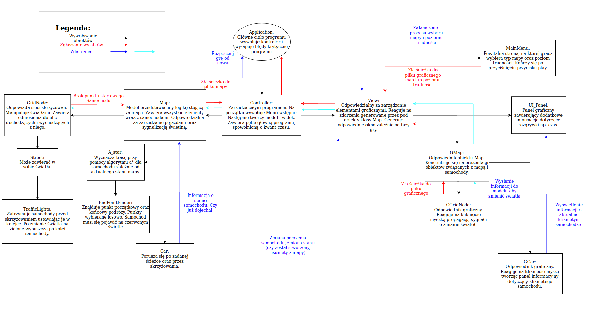

# PROZ-Projekt
Projekt zaliczeniowy - gra Zarządca ruchu

### Opis rozgrywki
Gra polega na uzbieraniu jak największej liczby punktów poprzez odpowiednią manipulację światłami sygnalizacyjnymi.
Do wyboru są trzy zróżnicowane mapy na planie siatki kwadratowej 5x5 oraz trzy poziomy trudności:
* Łatwy z 1 samochodem na mapie.
* Średni z 3 samochodami na mapie.
* Trudny z 10 samochodami na mapie.

Długość rozgrywki jest zależna od poziomu trudności.
Dodatkową funkcją ułatwiającą rozgrywkę jest możliwość kliknięcia na samochód i zobaczenia jaki jest cel jego podróży.


### Struktura programu
Projek został opracowany przy pomocy schematu MVC. 

Szkic pozwalający na zrozumienie ogólnej zasady działania programu.

### Uruchamianie programu
W folderze PROZ_GRADLE uruchomić komendę:

```
./gradlew run
```

W celu uruchomienia programu.

```
./gradlew test
```

W celu uruchomienia testów.
